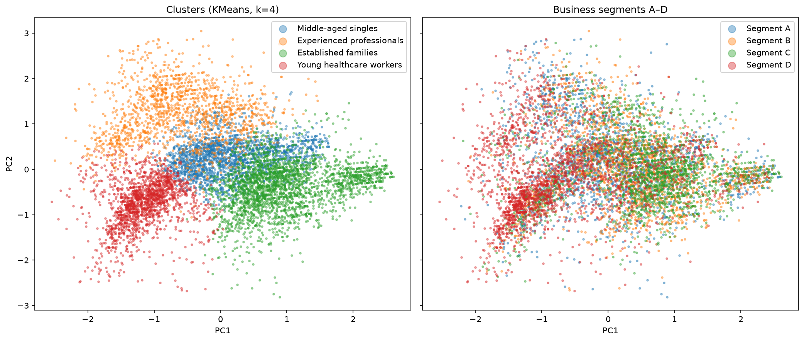

# Customer Segmentation


End-to-end ML project: customer clustering with a reproducible scikit-learn pipeline, experiment tracking and model registry in MLflow, REST API on FastAPI and Docker deployment.

## Problem

An automobile company plans to enter new markets with its existing products. In the current market, the sales team has split customers into 4 segments and uses a different outreach strategy for each of them.

The goal of this project is to build an unsupervised segmentation pipeline that:
- groups customers by their demographic profile without using the existing labels;
- assigns a segment to any new customer;
- produces segments that can be described and used by the marketing team.

## Data

[Customer Segmentation dataset](https://www.kaggle.com/datasets/vetrirah/customer/data) (Analytics Vidhya Janatahack, available on Kaggle).

- 8068 customers, 9 features: `Gender`, `Ever_Married`, `Age`, `Graduated`, `Profession`, `Work_Experience`, `Spending_Score`, `Family_Size`, `Var_1`.
- `Segmentation` (A–D) is the ground-truth segment from the sales team. It is **not** used for training, only for comparison with the obtained clusters.

Download `train.csv` and put it into `data/raw/`.

## Approach

### EDA

Key findings (`notebooks/01_eda.ipynb`):
- 6 of 9 features are categorical, so encoding is the core of preprocessing.
- 6 columns have missing values; the largest share is in `Work_Experience` (~10%).
- Missing values in `Family_Size` and `Work_Experience` are informative: customers with a missing value belong to segment D much more often.
- Numeric features are right-skewed and contain a few real outliers.
- 417 rows share identical features but have different IDs. These are different customers with the same profile, so they are kept.

### Preprocessing

Implemented as a scikit-learn `Pipeline` with `ColumnTransformer` (`src/pipeline.py`), so the same transformations are applied during training and to new customers.

| Features | Transformation |
|---|---|
| `Age`, `Work_Experience`, `Family_Size` | Median imputation + missing indicators, `RobustScaler` |
| `Gender`, `Ever_Married`, `Graduated` | Most frequent imputation, binary 0/1 encoding |
| `Spending_Score` | Ordinal encoding (Low < Average < High), `RobustScaler` |
| `Profession` | Missing values as a separate category, one-hot encoding |
| `Var_1` | Missing values as a separate category, one-hot encoding, categories below 5% grouped together |

Result: 24 numeric features.

### Experiments

KMeans with k from 2 to 8 was compared across three options: no PCA, PCA with 13 components (90% of variance) and PCA with 2 components. All metrics are computed in the same preprocessed feature space, so the options are directly comparable.

Silhouette score:

| k | No PCA | PCA 13 | PCA 2 |
|---|---|---|---|
| 2 | 0.156 | 0.156 | 0.154 |
| 3 | 0.171 | 0.171 | 0.155 |
| 4 | 0.158 | 0.158 | 0.123 |
| 5 | 0.146 | 0.145 | 0.117 |
| 6 | 0.135 | 0.135 | 0.093 |
| 7 | 0.135 | 0.136 | 0.096 |
| 8 | 0.134 | 0.137 | 0.087 |

Conclusions:
- PCA with 13 components gives the same quality as no PCA, so the simpler model without PCA is used.
- PCA with 2 components loses too much information and is used only for visualization.
- **k = 4** was chosen: best Davies–Bouldin score (1.89), elbow of the inertia curve, close silhouette to k = 3 (0.158 vs 0.171), and direct comparability with the 4 business segments.

## Results

Final model: KMeans with k = 4 on 24 preprocessed features, without PCA.

| Segment | Share | Key traits |
|---|---|---|
| Middle-aged singles | 26% | Live alone, median age 47, 100% low spending |
| Experienced professionals | 19% | Median work experience 8 years (overall: 1), small families |
| Established families | 33% | 98% married, median age 51, the only segment with high spending |
| Young healthcare workers | 22% | Median age 27, 9% married, 54% work in healthcare |

Detailed profiles: `notebooks/03_segment_profiles.ipynb`.



Comparison with the sales team's segments A–D (not used in training): ARI = 0.098, NMI = 0.099. Young healthcare workers strongly match segment D (63%), and established families correspond mostly to segments C and B. Demographic features alone are not enough to separate segments A, B and C.

## Serving

The champion model is served by a FastAPI service (`src/api.py`):
- `POST /predict` — takes a customer profile and returns the cluster number and segment name;
- `GET /health` — health check.

Input data is validated by Pydantic: invalid values (for example, `Age` below 18) return a `422` error. Fields that had missing values in the training data are optional, and the pipeline imputes them.

The model location is set by the `MODEL_URI` environment variable: by default the API loads the `champion` version from the MLflow Model Registry, while the Docker image uses the exported model from `models/champion`.

## Testing and CI

- `tests/test_pipeline.py` — pipeline tests on synthetic data: missing values, unseen categories, PCA option.
- `tests/test_api.py` — API tests: valid requests, optional fields, input validation errors.

GitHub Actions runs `ruff`, `pytest`, builds the Docker image and checks that the container responds on every push to `main`.

Run locally:

```bash
ruff check .
pytest -v
```

## Tech stack

Python 3.11, pandas, scikit-learn, MLflow, FastAPI, Docker, pytest, GitHub Actions, matplotlib, ruff

## Project structure

```
.github/
  workflows/
    ci.yml                          # CI pipeline
configs/
  config.yaml                       # data paths, hyperparameters, MLflow settings, segment names
data/                               # raw and processed data (not tracked by git)
models/
  champion/                         # exported model used by the Docker image
notebooks/
  01_eda.ipynb                      # exploratory data analysis
  02_preprocessing_prototype.ipynb  # manual preprocessing to validate EDA decisions
  03_segment_profiles.ipynb         # segment profiles and visualization
reports/
  figures/                          # figures for README
src/
  config.py                         # config loading
  data.py                           # data loading
  pipeline.py                       # preprocessing + clustering pipeline
  train.py                          # training with MLflow tracking and registration
  sweep.py                          # hyperparameter sweep
  promote.py                        # set the champion model version
  export_model.py                   # export the champion model for serving
  api.py                            # REST API for segment prediction
tests/
  conftest.py                       # test configuration
  test_pipeline.py                  # pipeline tests
  test_api.py                       # API tests
Dockerfile
```

## How to run

### Quick start with Docker

The repository already contains the exported model, so the API can be started without training:

```bash
git clone https://github.com/itachka3005/customer-segmentation.git
cd customer-segmentation
docker build -t customer-segmentation-api .
docker run -p 8000:8000 customer-segmentation-api
```

Open the interactive documentation at http://127.0.0.1:8000/docs.

Example request:

```bash
curl -X POST http://127.0.0.1:8000/predict \
  -H "Content-Type: application/json" \
  -d '{"Gender": "Female", "Ever_Married": "No", "Age": 27, "Graduated": "No", "Profession": "Healthcare", "Work_Experience": 1, "Spending_Score": "Low", "Family_Size": 4, "Var_1": "Cat_6"}'
```

Response:

```json
{"cluster": 3, "segment": "Young healthcare workers"}
```

### Full training workflow

1. Create a virtual environment and install dependencies:

```bash
python -m venv .venv
.venv\Scripts\activate          # Windows
# source .venv/bin/activate     # Linux / macOS
pip install -r requirements-dev.txt
```

2. Download the dataset into `data/raw/train.csv`.

3. Run the hyperparameter sweep (optional):

```bash
python -m src.sweep
```

4. Train the final model and register it in MLflow:

```bash
python -m src.train
```

5. Promote a model version to `champion`:

```bash
python -m src.promote 1
```

6. Explore experiments in the MLflow UI at http://127.0.0.1:5000:

```bash
mlflow ui
```

7. Run the API locally (loads the `champion` model from the registry):

```bash
uvicorn src.api:app --reload
```

8. Export the champion model for the Docker image:

```bash
python -m src.export_model
```

## Roadmap

- [x] Project scaffolding
- [x] Exploratory data analysis
- [x] Training pipeline
- [x] Experiment tracking with MLflow
- [x] Model registry
- [x] Segment interpretation
- [x] REST API (FastAPI)
- [x] Docker
- [x] Tests and CI